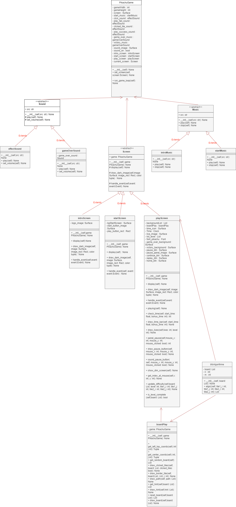

# Projet: Jeu classique Pikachu

# Auteur de projet: PHAM Tuan Anh

## Introduction:

Le projet Jeu classique Pikachu implique la mise en œuvre d'un jeu Pikachu traditionnel, dans lequel les joueurs associent des paires de tuiles identiques pour vider le plateau. L'objectif du jeu est d'éliminer toutes les tuiles dans un certain temps en trouvant des paires correspondantes et en les retirant du plateau.

Tout au long de ce projet, diverses fonctionnalités seront implémentées, notamment la correspondance des tuiles, la gestion du tableau, l'activation/désactivation du son, la progression des niveaux et la conception de l'interface. Le jeu sera développé en utilisant le langage de programmation Python et la bibliothèque Pygame pour le développement.

## Aperçu du projet:

Le projet Classic Pikachu Game comprendra les éléments suivants :

- Plateau de jeu : Le plateau de jeu sera représenté comme une grille de tuiles, chacune contenant des symboles ou des images différents. Les joueurs devront faire correspondre des paires de tuiles identiques pour les retirer du plateau.

- Correspondance de tuiles : les joueurs pourront sélectionner deux tuiles à la fois. Si les tuiles sélectionnées correspondent, elles seront supprimées du plateau. Sinon, les joueurs devront sélectionner une autre paire de tuiles.

- Progression des niveaux : Le jeu comprendra plusieurs niveaux, chacun avec une disposition différente des tuiles et une difficulté croissante. Les joueurs passeront au niveau suivant après avoir terminé le niveau actuel.

- Contrôle de la musique : les joueurs auront la possibilité d'activer ou de désactiver la musique de fond pendant le jeu, offrant ainsi une expérience personnalisable.

- Système de vies : Le jeu comprendra un système de vies dans lequel les joueurs auront un nombre limité de chances de commettre des erreurs. Si les joueurs ne parviennent pas à faire correspondre les tuiles dans le nombre de vies donné, la partie se terminera.

- utilise la touche "k" pour pirater le jeu:
  - Une fonctionnalité spéciale permet aux joueurs de « pirater » le jeu en utilisant la touche « K » pour supprimer des paires de tuiles de l'écran.
  - Utilisez cette fonctionnalité avec considération pour améliorer votre expérience de jeu ou pour tester des cas particuliers.
  - Attention : n'utilisez pas la touche "k" lorsqu'il ne reste qu'une seule paire de titres sur le plateau. car il rencontrera une erreur et ne pourra pas passer au niveau suivant

## UML



## Jeu

Si vous n'avez pas installé pygame, installez-le comme suit :

```
pip3 install pygame
```

Pour installer il faut aller dans le dossier `racine` et faire :

```
python3 ./src/PikachuGame.py
```

## Compiler les tests

- En raison de l'erreur import(ModuleNotFoundError: No module named), je ne peux pas placer tous les fichiers de test dans un seul dossier de tests.

- A cause d'un problème avec pygame, je ne peux pas tester les fonctions de playScreen

Pour installer il faut aller dans le dossier `racine` et faire :

```
python3 ./src/Board/test_board_play.py
python3 ./src/algorithme/test_bfs_algorithme.py
```

## Progression

- Jeudi 11 Janvier 2024:

  - Choisis un sujet pour mon projet personnel
  - Rechercher des images et des polices pour les projets
  - en savoir plus sur Pygame
  - A écrit le premier programme sur Pygame

- Jeudi 18 Janvier 2024:

  - Créez un écran d'introduction avec un son d'introduction qui dure 1 seconde

- Jeudi 25 Janvier 2024:

  - Apprenez à diviser d'une classe à plusieurs classes dans Pygame

- Jeudi 01 Febvier 2024:

  - Diviser d'une classe à plusieurs classes dans Pygame(continue)

- Jeudi 15 Febvier 2024:

  - creer d'un classe BoardPlay
  - ajouter des images (fond d'écran, images de niveau, live...)
  - créer des fonctions sur le dessin (dessiner en direct, dessiner la barre de temps)

- Jeudi 07 Mars 2024:
  - créer un écran de jeu à un niveau de base (jouable mais comportant encore de nombreuses erreurs)
- Jeudi 14 Mars 2024:
  - Fonctionnalité ajoutée pour afficher la musique et l'arrière-plan en cas de perte. puis revenez à l'écran de démarrage
- Jeudi 21 Mars 2024:
  - Créer un bouton marche/arrêt de la musique
- Jeudi 28 Mars 2024:
  - Complétez le bouton marche/arrêt du son
- 03 Avril 2024:
  - ajouter l'UML complet du code
  - Passer des tests dans 2 classes (BFSAlgorithme et BoardPlay)
  - Ecrire readme

## Fonctions principales

Vous trouverez ci-dessous les fonctions principales de la classe `bfsAlgorithme`, `boardPlay` et `playScreen`. Pour les autres méthodes, veuillez consulter le diagramme UML et pour plus de détails, veuillez directement consulter le code source de chaque classe.

### bfsAlgorithme

- La complexité temporelle de la fonction `algo` dans la classe `bfsAlgorithme` est O(MN). La complexité temporelle de `O(N^2)` dans le pire des cas. Où M et N sont respectivement le nombre de lignes et de colonnes de la carte d'entrée.

### boardPlay

- La complexité temporelle de la fonction `get_left_top_coords` dans la classe `boardPlay` est `O(1)`

- La complexité temporelle de la fonction `get_center_coords` dans la classe `boardPlay` est `O(1)`

- La méthode `get_random_board` a une complexité temporelle de O(n), où n est le nombre total de tuiles sur le plateau.

- La complexité temporelle de la méthode `get_hint` est `O(n^3)`, où `n` est le nombre de tuiles sur le plateau. En effet, la méthode utilise une boucle imbriquée pour parcourir chaque tuile du tableau et, pour chaque tuile, elle parcourt toutes les autres tuiles ayant la même valeur. Ensuite, pour chaque paire de tuiles, il appelle la méthode algo de la classe bfsAlgorithme, qui a une complexité temporelle de `O(n^2)` dans le pire des cas. Par conséquent, la complexité temporelle globale de la méthode `get_hint` est `O(n^3)`

- La complexité temporelle de la fonction `reset_board` est `O(n^2)`, où `n` est le nombre de tuiles sur le plateau. La fonction crée d'abord une liste de toutes les tuiles non nulles du plateau, ce qui prend un temps `O(n)`. Il mélange ensuite la liste, ce qui prend un temps `O(n)`. La boucle intérieure qui parcourt le plateau et place les tuiles mélangées prend un temps `O(n^2)`, car elle parcourt le plateau deux fois. Par conséquent, la complexité temporelle globale est `O(n^2)`.

### playScreen

- La méthode `check_time` a une complexité temporelle de `O(1)`

- La méthode `get_index_at_mouse(self,x, y)` a une complexité temporelle de `O(1)`

- La méthode `update_difficulty(self,board, level, tile1_i, tile1_j, tile2_i, tile2_j)` met à jour la difficulté du jeu en fonction du niveau actuel. La complexité temporelle de cette fonction est `O(1)` car elle effectue un nombre constant d'opérations quelle que soit la taille du tableau ou le niveau.
- La complexité temporelle de la méthode `is_level_complete(self,board)` est `O(n)`, où `n` est le nombre total de cellules dans le tableau.

## Conclusion:

Le projet Classic Pikachu Game vise à offrir une expérience de jeu divertissante et stimulante aux joueurs de tous âges. En implémentant diverses fonctionnalités telles que la correspondance de tuiles, la progression de niveau, le contrôle de la musique et le système de vies, le projet offrira une expérience de jeu engageante. Grâce à un développement et à des tests itératifs, le projet sera affiné pour garantir une fonctionnalité fluide et une expérience utilisateur agréable.
